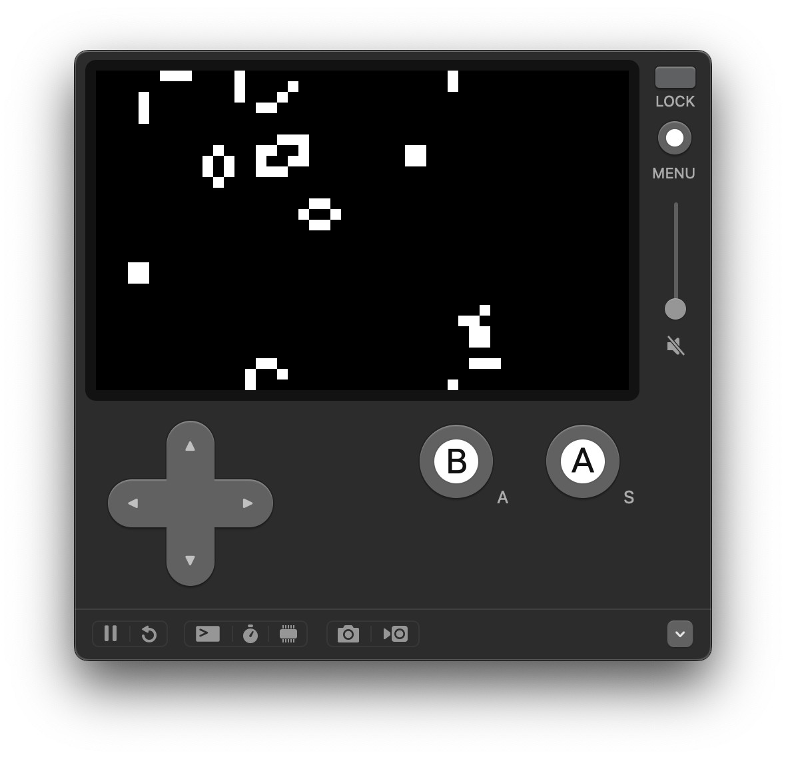

# game-of-life-playdate

This is [the Game of Life](https://github.com/kkebo/GameOfLife.swiftpm) for Playdate.

## Build requirements

- macOS 14.5 or later
- Xcode 16 or later
- [Swift OSS toolchain](https://www.swift.org/install/macos/)
  - The toolchain bundled with Xcode does not support Embedded Swift
- [Playdate SDK](https://play.date/dev/)

## Get Started

1. Clone this repository
1. Run `TOOLCHAINS=<your toolchain identifier> make` on the terminal
    - To determine the toolchain identifier, please see [here](https://apple.github.io/swift-playdate-examples/documentation/playdate/buildingtheexamples#Determining-the-Toolchain-Identifier).
1. Open `GameOfLife.pdx` with the Playdate Simulator app
